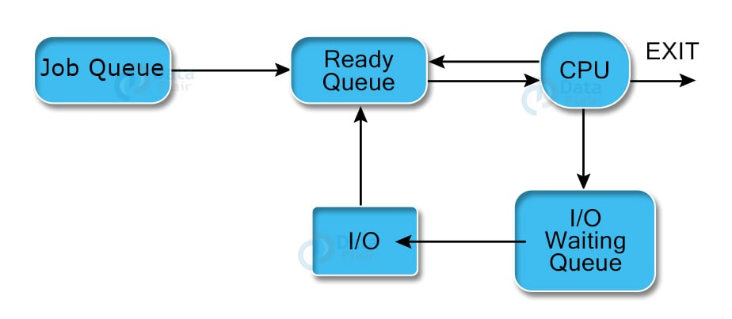

## Chapter 3

### Process Concept (3.1)

#### Definition of a Process

- A **process** is an instance of a program in execution.
- It represents a program that has been loaded into RAM and is currently being executed by the CPU.
- A process serves as a unit of work within an operating system and contains:
    - **Threads**: Each process can have one or more threads. If it has no threads, the OS will terminate the process.
        - A thread feeds instructions to the CPU
    - **Security Token**: This defines the permissions of the process, specifying what resources it can access.
    - **Code (Text)**: The executable instructions of the program.
    - **Constants (Data)**: Fixed values used by the program.
    - **Private Virtual Address Space**: The memory space allocated to the process, which isolates it from other
      processes.
        - **Stack**
        - **Heap**
    - **Private Handle Table**: A structure that keeps track of system resources (like files and network connections)
      that the process can use.
- A process encapsulates all necessary information for executing the program.

#### Definition of a Process Control Block (PCB)

- The **Process Control Block (PCB)** is a data structure maintained by the operating system to manage and track a
  process's execution.
- A PCB contains critical information such as:
    - **State**: The current state of the process (e.g., running, waiting).
    - **UID**: A unique identifier for the process.
    - **Privileges**: The resources the process is authorized to access.
    - **Program Counter**: Indicates the next instruction to be executed.
    - **CPU Registers**: The values of the CPU registers when the process was last executed.
    - **CPU Scheduling Info**: Includes priority level and pointers for scheduling queues.
    - **Virtual Memory Info**: Details about the virtual memory allocated to the process.
    - **Parent Process ID**: Identifies the process that created it.
    - **I/O Info**: A list of open file descriptors.

#### Relationship between Process and Process Control Block

- **Representation**: The PCB represents the process to the operating system, encapsulating its state and attributes,
  but is not the process itself.
- **Management**: The OS uses the PCB to manage a process's lifecycle, switching between states (e.g., ready, running,
  blocked) and scheduling it for CPU time.
- In summary, while a process is the active entity performing tasks, the PCB is a data structure containing all
  necessary information to manage that process. They are interconnected but distinct entities.

#### Process States

- A process can exist in various states:
    - **New**: The process is being created.
    - **Ready**: The process is prepared to run but is waiting for CPU time.
    - **Running**: The process is currently being executed by the CPU.
    - **Terminated**: The process has finished execution.
    - **Waiting**: The process is waiting for an event (e.g., I/O operation) to complete.

- The **Process Scheduler** or **Dispatcher** in the operating system examines all processes in the ready state and
  decides which process
  will run on the CPU.
- A running process may be preempted and moved back to the ready state or may terminate upon completion.

##### Odd States to know about

1. **Orphan Process**:
    - **Definition**: A child process whose parent has terminated without waiting for it.
    - **Impact**: The orphan process is adopted by the init process (PID 1) to ensure it can continue execution.

2. **Zombie Process**:
    - **Definition**: A child process that has completed execution but still has an entry in the process table because
      its parent has not yet read its exit status.
    - **Impact**: Occupies resources (like PID) until the parent calls wait() to retrieve its exit status.

#### Process Types

1. **I/O Bound**:
    - **Description**: Processes that spend more time waiting for I/O operations (like disk or network) than using the
      CPU.
    - **Scheduling Focus**: Should prioritize these processes to minimize wait time and improve overall system
      responsiveness.

2. **CPU Bound**:
    - **Description**: Processes that require more CPU time and perform computations more than waiting for I/O.
    - **Scheduling Focus**: These processes should be managed to ensure they have sufficient CPU time for effective
      execution.

#### Additional Resources

- [What is a Process? Video Explanation](https://www.youtube.com/watch?v=vLwMl9qK4T8)
- [What is a Process? Video Explanation](https://www.youtube.com/watch?v=LAnWQFQmgvI)

### Process Scheduling (3.2)

#### Scheduling Queues

In the Process State Lifecycle, multiple types of schedulers manage different queues to optimize process execution.
Here's an overview of the key scheduling queues:

1. **Job Queue**
    - **Description:** This queue contains all processes in the system that are waiting to be loaded into memory for
      execution. It holds jobs that await admission to the ready queue.
    - **Scheduler:** Long-term Scheduler (Job Scheduler)
    - **Function:** The long-term scheduler determines which processes from the job queue are moved into memory,
      transitioning them to the ready queue. It manages the overall degree of multiprogramming, ensuring efficient use
      of system resources.

2. **Ready Queue**
    - **Description:** This queue holds all processes that are currently in memory and ready to execute but are waiting
      for CPU time. These processes are fully prepared to run and only need CPU availability.
    - **Scheduler:** Short-term Scheduler (CPU Scheduler)
    - **Function:** The short-term scheduler selects one of the processes from the ready queue to execute on the CPU.
      This scheduler operates frequently and makes rapid decisions to maximize CPU utilization and ensure efficient
      process management.

3. **Device Queue**
    - **Description:** This queue contains processes that are waiting for I/O operations to complete. When a process
      requests an I/O operation, it is moved from the ready queue to the device queue until the operation is finished.
    - **Scheduler:** While there isn't a specific medium-term scheduler for device queues, their management involves the
      short-term scheduler in conjunction with the I/O management subsystem.
    - **Function:** The scheduler facilitates the transition of processes between the ready queue and device queues,
      ensuring that processes can return to the ready queue once their I/O operations are complete.

#### Context Switch

A context switch involves saving the state of the currently executing process (Process 1) and loading the state of the
next process to be executed (Process 2). This includes transferring register values and program counter information to
the process control block (PCB) in RAM. When Process 1 resumes, it continues execution as if uninterrupted.

While necessary for multitasking, context switching is resource-intensive, often consuming thousands of CPU cycles.
Efficient management of context switches is crucial for maintaining optimal system performance.

#### Context Switch Triggers

Context switches are triggered by several events, including:

1. **Process Scheduling:** When the short-term scheduler selects a new process to run, a context switch occurs to load
   the new process into the CPU.

2. **I/O Requests:** If a running process requests an I/O operation, it is moved to the device queue, triggering a
   context switch to allow another process in the ready queue to execute.

3. **Process Termination:** When a process completes its execution, a context switch occurs to load another process from
   the ready queue.

4. **Time Slices Expiration:** In time-sharing systems, if a process's allocated time slice expires, a context switch is
   triggered to ensure fair CPU time distribution among processes.

5. **Inter-process Communication (IPC):** When processes communicate or synchronize, a context switch may occur if one
   process must yield control to allow another to proceed.

#### Additional Resources

- [What is Process Scheduling? Video Explanation](https://www.youtube.com/watch?v=2h3eWaPx8SA)

### Operations on Processes (3.3)

#### Process Management

##### 1. Process Creation

- **System Call**: `fork()`
    - **Function**: Creates a new process by duplicating the calling process.
    - **Outcome**: The new process (child) is an exact copy of the parent process, with a unique Process ID (PID). The
      return value in the parent is the PID of the child, while the child receives a return value of 0.

##### 2. Process Replacement

- **System Call**: `exec()`
    - **Function**: Replaces the current process image with a new process image.
    - **Outcome**: The calling process is transformed into a new process, losing its previous execution context (code,
      data, and stack). It starts execution from the entry point of the new program. Variants include `execl()`,
      `execv()`, `execle()`, `execve()`, etc.

##### 3. Process Termination

- **System Call**: `exit()`
    - **Function**: Terminates the calling process and returns a status code to the operating system.
    - **Outcome**: The process releases all its resources and informs its parent process of its termination status.

- **System Call**: `wait()`
    - **Function**: Allows a parent process to wait for its child processes to finish execution.
    - **Outcome**: The parent can retrieve the exit status of the terminated child.

##### 4. Process Synchronization

- **System Calls**:
    - `sem_wait()` and `sem_post()` (for semaphores)
    - `pthread_mutex_lock()` and `pthread_mutex_unlock()` (for mutexes in POSIX threads)
    - **Function**: Tools used to control access to shared resources and prevent race conditions.
    - **Outcome**: Ensures that multiple processes can operate safely on shared data without conflicting.

##### 5. Process Prioritization

- **System Call**: `nice()`
    - **Function**: Changes the priority of a process.
    - **Outcome**: A higher nice value indicates a lower priority, affecting the order of CPU allocation.

##### 6. Process Resource Management

- **System Call**: `setrlimit()`
    - **Function**: Sets resource limits for a process (e.g., CPU time, memory usage).
    - **Outcome**: Ensures efficient use of resources and helps prevent overconsumption.

##### 7. Process Monitoring

- **System Calls**:
    - `getpid()`: Returns the process ID of the calling process.
    - `getppid()`: Returns the parent process ID.
    - **Note**: While `ps()` is not a direct system call, it is a common command used to monitor processes in Unix-like
      systems.
    - **Outcome**: Administrators can observe active processes, CPU usage, memory consumption, and detect potential
      issues in real-time.

### Interprocess Communication (3.4)

#### Types of processes

Process execuring concurrently in the operating system may be either `independent processes` or `cooperating prcoesses`.

- Independent processes
    - They cannot affect or be affected by the other processes execurting in the system.
- Cooperating processes
    - They can affect or be affected by the other processes executing in the system.

Any proceess that shares data with other processes in a cooperating process.

#### Why allow process cooperation

- Information sharing
    - Several users may be interested in a single file. All users should be able to open that file at the same time.
- Computation speedup
    - We can split up a task into smaller tasks and complete it with many processes
- Modularity
    - Different parts of the system may need to work together to acheve a single goal

#### How interprocess communication works

There are two fundamental models of interprocess communication:

- Shared Memory
    - A region of memory that is shared by cooperating processes is established.
    - Processes can then exchange information by reading and writing data to the shared region.
- Message passing
    - Communication tkaes place by means of messages exchanged between the cooperating processes.

#### Helpful video

[Interprocess Communication](https://www.youtube.com/watch?v=dJuYKfR8vec)

### Shared Memory Systems (3.5)

### Message Passing Systems (3.6)
