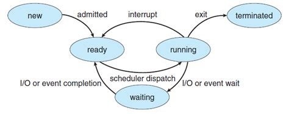
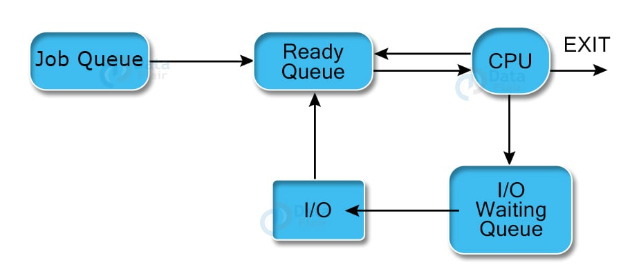
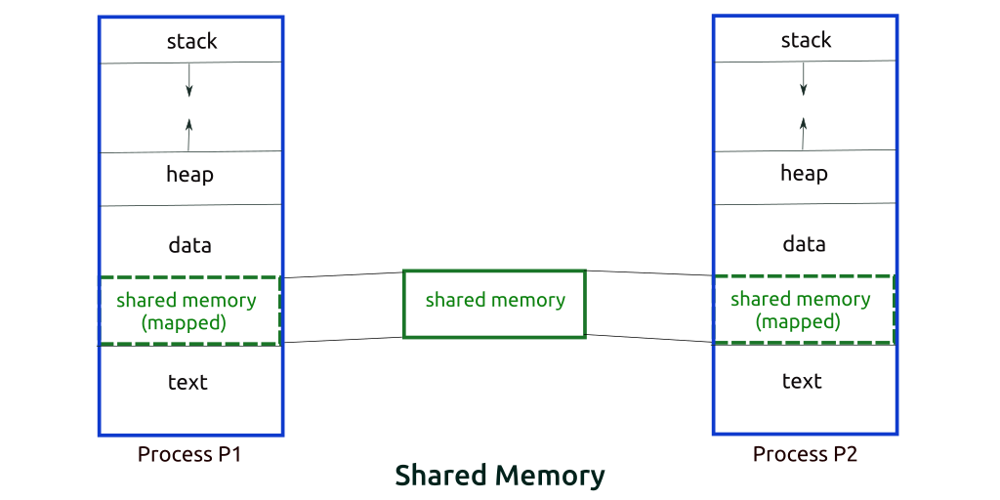
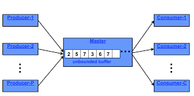
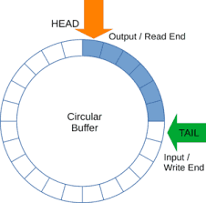
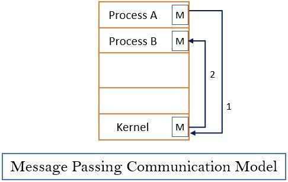

## Chapter 3

### Process Concept (3.1)

#### Definition of a Process

- A **process** is an instance of a program in execution.
- It represents a program that has been loaded into RAM and is currently being executed by the CPU.
- A process serves as a unit of work within an operating system and contains:
    - **Threads**: Each process can have one or more threads. If it has no threads, the OS will terminate the process.
        - A thread feeds instructions to the CPU
    - **Security Token**: This defines the permissions of the process, specifying what resources it can access.
    - **Code (Text)**: The executable instructions of the program.
    - **Constants (Data)**: Fixed values used by the program.
    - **Private Virtual Address Space**: The memory space allocated to the process, which isolates it from other
      processes.
        - **Stack**
        - **Heap**
    - **Private Handle Table**: A structure that keeps track of system resources (like files and network connections)
      that the process can use.
- A process encapsulates all necessary information for executing the program.

#### Definition of a Process Control Block (PCB)

- The **Process Control Block (PCB)** is a data structure maintained by the operating system to manage and track a
  process's execution.
- A PCB contains critical information such as:
    - **State**: The current state of the process (e.g., running, waiting).
    - **UID**: A unique identifier for the process.
    - **Privileges**: The resources the process is authorized to access.
    - **Program Counter**: Indicates the next instruction to be executed.
    - **CPU Registers**: The values of the CPU registers when the process was last executed.
    - **CPU Scheduling Info**: Includes priority level and pointers for scheduling queues.
    - **Virtual Memory Info**: Details about the virtual memory allocated to the process.
    - **Parent Process ID**: Identifies the process that created it.
    - **I/O Info**: A list of open file descriptors.

#### Relationship between Process and Process Control Block

- **Representation**: The PCB represents the process to the operating system, encapsulating its state and attributes,
  but is not the process itself.
- **Management**: The OS uses the PCB to manage a process's lifecycle, switching between states (e.g., ready, running,
  blocked) and scheduling it for CPU time.
- In summary, while a process is the active entity performing tasks, the PCB is a data structure containing all
  necessary information to manage that process. They are interconnected but distinct entities.

#### Process States

- A process can exist in various states:
    - **New**: The process is being created.
    - **Ready**: The process is prepared to run but is waiting for CPU time.
    - **Running**: The process is currently being executed by the CPU.
    - **Terminated**: The process has finished execution.
    - **Waiting**: The process is waiting for an event (e.g., I/O operation) to complete.

- The **Process Scheduler** or **Dispatcher** in the operating system examines all processes in the ready state and
  decides which process
  will run on the CPU.
- A running process may be preempted and moved back to the ready state or may terminate upon completion.



##### Odd States to know about

1. **Orphan Process**:
    - **Definition**: A child process whose parent has terminated without waiting for it.
    - **Impact**: The orphan process is adopted by the init process (PID 1) to ensure it can continue execution.

2. **Zombie Process**:
    - **Definition**: A child process that has completed execution but still has an entry in the process table because
      its parent has not yet read its exit status.
    - **Impact**: Occupies resources (like PID) until the parent calls wait() to retrieve its exit status.

#### Process Types

1. **I/O Bound**:
    - **Description**: Processes that spend more time waiting for I/O operations (like disk or network) than using the
      CPU.
    - **Scheduling Focus**: Should prioritize these processes to minimize wait time and improve overall system
      responsiveness.

2. **CPU Bound**:
    - **Description**: Processes that require more CPU time and perform computations more than waiting for I/O.
    - **Scheduling Focus**: These processes should be managed to ensure they have sufficient CPU time for effective
      execution.

#### Additional Resources

- [What is a Process? Video Explanation](https://www.youtube.com/watch?v=vLwMl9qK4T8)
- [What is a Process? Video Explanation](https://www.youtube.com/watch?v=LAnWQFQmgvI)

### Process Scheduling (3.2)

#### Scheduling Queues

In the Process State Lifecycle, multiple types of schedulers manage different queues to optimize process execution.
Here's an overview of the key scheduling queues:

1. **Job Queue**
    - **Description:** This queue contains all processes in the system that are waiting to be loaded into memory for
      execution. It holds jobs that await admission to the ready queue.
    - **Scheduler:** Long-term Scheduler (Job Scheduler)
    - **Function:** The long-term scheduler determines which processes from the job queue are moved into memory,
      transitioning them to the ready queue. It manages the overall degree of multiprogramming, ensuring efficient use
      of system resources.

2. **Ready Queue**
    - **Description:** This queue holds all processes that are currently in memory and ready to execute but are waiting
      for CPU time. These processes are fully prepared to run and only need CPU availability.
    - **Scheduler:** Short-term Scheduler (CPU Scheduler)
    - **Function:** The short-term scheduler selects one of the processes from the ready queue to execute on the CPU.
      This scheduler operates frequently and makes rapid decisions to maximize CPU utilization and ensure efficient
      process management.

3. **Device Queue**
    - **Description:** This queue contains processes that are waiting for I/O operations to complete. When a process
      requests an I/O operation, it is moved from the ready queue to the device queue until the operation is finished.
    - **Scheduler:** While there isn't a specific medium-term scheduler for device queues, their management involves the
      short-term scheduler in conjunction with the I/O management subsystem.
    - **Function:** The scheduler facilitates the transition of processes between the ready queue and device queues,
      ensuring that processes can return to the ready queue once their I/O operations are complete.



#### Context Switch

A context switch involves saving the state of the currently executing process (Process 1) and loading the state of the
next process to be executed (Process 2). This includes transferring register values and program counter information to
the process control block (PCB) in RAM. When Process 1 resumes, it continues execution as if uninterrupted.

While necessary for multitasking, context switching is resource-intensive, often consuming thousands of CPU cycles.
Efficient management of context switches is crucial for maintaining optimal system performance.

#### Context Switch Triggers

Context switches are triggered by several events, including:

1. **Process Scheduling:** When the short-term scheduler selects a new process to run, a context switch occurs to load
   the new process into the CPU.

2. **I/O Requests:** If a running process requests an I/O operation, it is moved to the device queue, triggering a
   context switch to allow another process in the ready queue to execute.

3. **Process Termination:** When a process completes its execution, a context switch occurs to load another process from
   the ready queue.

4. **Time Slices Expiration:** In time-sharing systems, if a process's allocated time slice expires, a context switch is
   triggered to ensure fair CPU time distribution among processes.

5. **Inter-process Communication (IPC):** When processes communicate or synchronize, a context switch may occur if one
   process must yield control to allow another to proceed.

#### Additional Resources

- [What is Process Scheduling? Video Explanation](https://www.youtube.com/watch?v=2h3eWaPx8SA)

### Operations on Processes (3.3)

#### Process Management

##### 1. Process Creation

- **System Call**: `fork()`
    - **Function**: Creates a new process by duplicating the calling process.
    - **Outcome**: The new process (child) is an exact copy of the parent process, with a unique Process ID (PID). The
      return value in the parent is the PID of the child, while the child receives a return value of 0.

##### 2. Process Replacement

- **System Call**: `exec()`
    - **Function**: Replaces the current process image with a new process image.
    - **Outcome**: The calling process is transformed into a new process, losing its previous execution context (code,
      data, and stack). It starts execution from the entry point of the new program. Variants include `execl()`,
      `execv()`, `execle()`, `execve()`, etc.

##### 3. Process Termination

- **System Call**: `exit()`
    - **Function**: Terminates the calling process and returns a status code to the operating system.
    - **Outcome**: The process releases all its resources and informs its parent process of its termination status.

- **System Call**: `wait()`
    - **Function**: Allows a parent process to wait for its child processes to finish execution.
    - **Outcome**: The parent can retrieve the exit status of the terminated child.

##### 4. Process Synchronization

- **System Calls**:
    - `sem_wait()` and `sem_post()` (for semaphores)
    - `pthread_mutex_lock()` and `pthread_mutex_unlock()` (for mutexes in POSIX threads)
    - **Function**: Tools used to control access to shared resources and prevent race conditions.
    - **Outcome**: Ensures that multiple processes can operate safely on shared data without conflicting.

##### 5. Process Prioritization

- **System Call**: `nice()`
    - **Function**: Changes the priority of a process.
    - **Outcome**: A higher nice value indicates a lower priority, affecting the order of CPU allocation.

##### 6. Process Resource Management

- **System Call**: `setrlimit()`
    - **Function**: Sets resource limits for a process (e.g., CPU time, memory usage).
    - **Outcome**: Ensures efficient use of resources and helps prevent overconsumption.

##### 7. Process Monitoring

- **System Calls**:
    - `getpid()`: Returns the process ID of the calling process.
    - `getppid()`: Returns the parent process ID.
    - **Note**: While `ps()` is not a direct system call, it is a common command used to monitor processes in Unix-like
      systems.
    - **Outcome**: Administrators can observe active processes, CPU usage, memory consumption, and detect potential
      issues in real-time.

### Interprocess Communication (3.4)

#### Types of Processes

Processes executing concurrently in an operating system can be categorized as either **independent processes** or *
*cooperating processes**:

- **Independent Processes**:
  These processes do not share data; they operate independently and cannot affect or be affected by one another.

- **Cooperating Processes**:
  These processes can share data and resources, allowing them to affect and be affected by one another.

#### Reasons for IPC

1. **Information Sharing**:
   Allows multiple users or processes to access shared resources, such as files, simultaneously.

2. **Speedup**:
   Enables the division of tasks into smaller parts, which can be executed concurrently by multiple processes, improving
   overall efficiency.

3. **Modularity**:
   Promotes organization within the system, facilitating easier maintenance and collaboration among different system
   components.

#### Methods of IPC

IPC can be achieved through two fundamental models:

1. **Shared Memory**:
    - Description: A designated region of memory is shared among cooperating processes.
    - Use Case: This method allows for efficient, high-speed data exchange by enabling processes to read and write data
      directly to the shared memory space.

2. **Message Passing**:
    - Description: Processes communicate by sending messages to one another, rather than accessing shared memory.
    - Use Case: This approach is particularly useful for processes that do not share memory, allowing for communication
      through well-defined messages.


#### Helpful Resource

For further learning, check out this [Interprocess Communication video](https://www.youtube.com/watch?v=dJuYKfR8vec).

### Shared Memory Systems (3.5)

#### Overview of Shared Memory

Shared memory is a method of interprocess communication that allows processes to communicate by establishing a shared
memory region. This memory typically resides in the address space of the process that creates it. Other processes can
attach this shared memory to their own address spaces for communication.

**Key Points:**

- The operating system generally prevents one process from accessing another's memory.
- For shared memory communication, processes must agree to bypass this restriction.

#### Producer-Consumer Model

The Producer-Consumer model is a synchronization pattern where one process (the producer) generates data, while another
process (the consumer) consumes it.

**Example:**
In a typical scenario, a compiler produces assembly code consumed by an assembler, which in turn produces object modules
consumed by a loader.

**Goal:**
To ensure the producer and consumer operate concurrently, allowing the consumer to consume only what has been produced
without attempting to consume nonexistent data.



#### Buffer Types

To facilitate this model, a buffer acts as shared memory where data can be temporarily stored.

1. **Unbounded Buffer:**
    - **Producer:** Can produce items without waiting, as there is unlimited space.
    - **Consumer:** Must wait if the buffer is empty but can consume whenever items are available.

   

2. **Bounded Buffer:**
    - **Non-Overwriting Bounded Buffer:**
        - **Producer:** Must wait if the buffer is full, preventing new data from being added until there is space.
        - **Consumer:** Must wait if the buffer is empty, ensuring that no data is consumed until it is available.
        - **Key Feature:** Items cannot be overwritten until they have been consumed, maintaining data integrity.

   

    - **Overwriting Bounded Buffer:**
        - **Producer:** Can overwrite the oldest data if the buffer is full, allowing continuous production without
          waiting.
        - **Consumer:** Must wait if the buffer is empty, ensuring that data is consumed as it becomes available.
        - **Key Feature:** Allows for flexible usage of buffer space, but risks losing unconsumed data if not managed
          carefully.

   

#### Synchronization

To effectively implement the Producer-Consumer model, synchronization is necessary to ensure:

- The consumer does not attempt to consume an item that hasn't been produced yet.
- The processes operate in harmony without conflicting over shared resources.

#### Helpful Resource

For a deeper understanding, check out this [Shared Memory Systems video](https://www.youtube.com/watch?v=uHtzOFwgD74).

### Message Passing Systems (3.6)

Message passing is a crucial method for enabling processes to communicate and synchronize actions without sharing the same address space. 
This approach is particularly advantageous in distributed systems, where processes may operate on different machines connected through a network.



#### Key Operations

A message-passing facility typically encompasses the following operations:
- **Send(message)**: A process generates and transmits a message to another process.
- **Receive(message)**: A process retrieves a message sent by another process or the system.

#### Communication Requirements

For effective communication between processes \( P \) and \( Q \):
- A communication link must be established between them.
- This link can be implemented using various methods, depending on the system architecture.

#### Implementation Methods

1. **Direct vs. Indirect Communication**:
    - **Direct Communication**: Processes communicate directly by naming each other (e.g., sending a message to a specific process ID). In this system processes need to know about the processes they are communicating with. 
        - **Properties**
            - There is exactly one pair of processes, a link is establised between each pair to communicate. Can lead to having an expontial amount of links.
            - Typically, these links are bi-directional but can also be uni-directional.
        - **Operations**
            - ```Send(P, message)```
            - ```receieve(Q, message)```
            - Where P and Q are the processes identifying the to/from of the message respectively.
        - **Major Issue**
            - Maintenance can be difficult because identifying processes may require hard codeing.
        
    - **Indirect Communication**: Processes send messages to shared mailboxes or queues, allowing for more flexible communication. In this system processes don't need to know anything about each other unless they share a mailbox.
        - **Properties**
            - A link only needs to be established if they share a mailbox.
            - Process can only communicate if they share a mailbox.
            - Multiple links between process pairs because each can connect to the mailbox and grab what's in there.
            - Both uni and bidirectional
            - Each process can own a mailbox
            - Only owner of the mailbox can recieve
            - Any process can act as a user of the mailbox/send to a mailbox
        - **Operations**
            - ```Send(A, message)```
            - ```receieve(A, message)```
            - Where A is the mailbox
        - **Major Issue**
            - You must decide how a recieve is handled and when.

2. **Synchronous vs. Asynchronous Communication**:
    - **Synchronous Communication**: The sender waits until the message is received before continuing its execution. This ensures that both processes are synchronized but may lead to blocking.
    - **Asynchronous Communication**: The sender proceeds without waiting for the receiver to acknowledge the message, allowing for greater flexibility and non-blocking operations.

3. **Buffering Strategies**:
    - **Automatic Buffering**: The system automatically handles message storage, allowing the sender and receiver to operate independently.
    - **Explicit Buffering**: The sender and receiver must manage message buffers explicitly, requiring additional programming overhead.

#### Key Issues in Message Passing

1. **Link Establishment**: How is the communication link created? Is it established dynamically or statically?
2. **Number of Links**: What is the maximum number of communication links a process can maintain? This may vary based on system design.
3. **Message Size**: What are the constraints on message size? Systems may impose limits to ensure efficient processing.
4. **Directionality**: Is the communication one-way (uni-directional) or two-way (bi-directional)? Bi-directional communication allows for more interactive processes.
5. **Buffering**: Is the message buffered (stored temporarily) or non-buffered (immediate transfer)? Buffering can enhance communication efficiency, especially in asynchronous scenarios.
6. **Blocking Behavior**: Is the communication blocking (the sender waits for the receiver) or non-blocking (the sender proceeds immediately)? Blocking may simplify synchronization but can hinder performance.

#### Examples of Message Passing

- **Client-Server Models**: In web applications, a client (user's browser) sends requests to a server, which processes the request and sends back a response. This is often implemented using synchronous communication.
- **Distributed Databases**: Different nodes in a distributed database may use message passing to coordinate transactions, ensuring consistency and data integrity through asynchronous communication.
- **Real-Time Systems**: In real-time applications like robotics, messages are sent and received between sensors and controllers, often requiring low latency and reliable communication.

#### Helpful Resource

For further insights, check out this [Message Passing Systems video](https://www.youtube.com/watch?v=LuuSXWkDJOo&list=TLPQMTAxMDIwMjRzF3SAPwVBjg&index=1).
