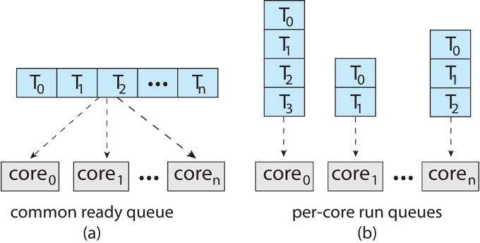
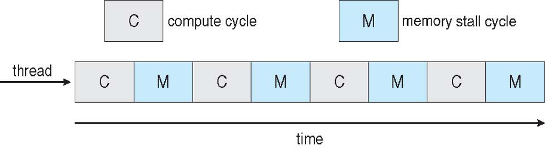
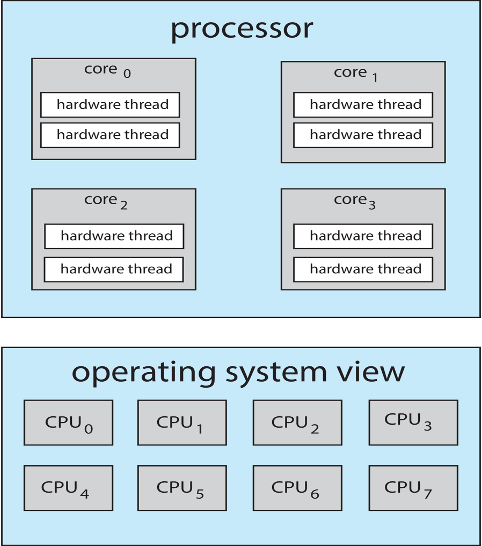
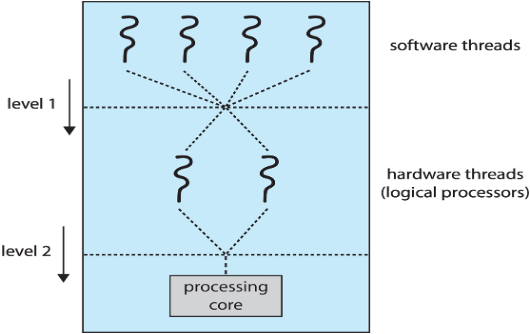

# Chapter 5

## Scheduling Algorithms (5.3)

### First-Come, First-Served (FCFS) Scheduling

#### Overview
- **FCFS** is a scheduling algorithm where processes are executed in the order of their arrival.
- **Non-preemptive**: Once a process starts executing, it runs to completion without being interrupted.
- Each process is executed in its entirety before moving on to the next one.

#### Example

##### Process Details

| Process | Burst Time |
|---------|------------|
| P1      | 24         |
| P2      | 3          |
| P3      | 3          |

##### Arrival Order
- Assume the processes arrive at **T = 0**, almost simultaneously:
    - **Arrival Order**: P1, P2, P3

##### Total Time
- The total time to complete all processes is:
    - **Total Time = 24 (P1) + 3 (P2) + 3 (P3) = 30**

##### Wait Times
- **P1**: Waits 0 units of time because it starts first.
- **P2**: Waits 24 units of time (P1’s burst time).
- **P3**: Waits 27 units of time (P1 + P2’s burst times).

  **Total Wait Time = 0 + 24 + 27 = 51**

##### Average Wait Time
- **Average Wait Time** = (0 + 24 + 27) / 3 = **17** units.

#### Alternate Arrival Order

##### Arrival Order: P2, P3, P1
- **Total Time** = 3 (P2) + 3 (P3) + 24 (P1) = **30**

##### Wait Times
- **P1**: Waits 6 units of time.
- **P2**: Waits 0 units of time (starts immediately).
- **P3**: Waits 3 units of time.

  **Total Wait Time = 6 + 0 + 3 = 9**

##### Average Wait Time
- **Average Wait Time** = (6 + 0 + 3) / 3 = **3** units.
- This is **much better** compared to the first scenario.

#### Key Concepts

##### Convoy Effect
- The **convoy effect** happens when long processes hold up shorter ones, causing inefficiencies.
- Example: In **FCFS**, if a long process (CPU-bound) arrives first, it delays all subsequent processes (especially shorter, I/O-bound ones).

##### Real-World Analogy

- **Dean’s Favorite Video**: Think of driving in **Cache Valley**—one slow-moving car holding everyone else up, much like how a long process can hold up others in FCFS.
    - Example: **Convoy 1978** movie featuring Kris Kristofferson, Ali MacGraw, and Ernest Borgnine.

- **Chad's Analogy**: Picture a checkout line at the grocery store:
    - One person with a cart full of 100 Kool-aid packages holds up the entire line, while you only have a small package of gum. You have to wait for a long time due to their slow checkout speed.

##### CPU-bound vs. I/O-bound Processes
- **CPU-bound processes**: Require a lot of processing time.
- **I/O-bound processes**: Frequently interact with input/output devices (e.g., disks, network), and thus, don’t need as much CPU time.
- In **FCFS**, a CPU-bound process can delay many smaller I/O-bound processes, which results in inefficient use of system resources.

### Shortest Job First (SJF)

#### Overview
- **SJF** schedules processes based on the **shortest burst time** remaining.
- Ideally called **Shortest Next CPU Burst**, because it focuses on the next shortest burst.
- Once a process completes its burst time, it returns to the queue but **cannot be scheduled next**, even if it has the next shortest remaining burst time.
- **Non-preemptive**: Once a process starts, it runs to completion.

#### Example: Simple Scenario

##### Process Details

| Process | Burst Time |
|---------|------------|
| P1      | 6          |
| P2      | 8          |
| P3      | 7          |
| P4      | 3          |

##### Arrival Order
- Processes arrive at **T = 0** in the order: **P1, P2, P3, P4**

##### Total Time
- The total time to complete all processes is:
    - **Total Time = 6 (P1) + 8 (P2) + 7 (P3) + 3 (P4) = 24**

##### Wait Times
- **P1**: Waits 3 units of time (P4 completes first).
- **P2**: Waits 16 units of time.
- **P3**: Waits 9 units of time.
- **P4**: Waits 0 units of time (P4 starts immediately).

  **Total Wait Time = 3 + 16 + 9 + 0 = 28**

##### Average Wait Time
- **Average Wait Time** = (3 + 16 + 9 + 0) / 4 = **7** units.

##### Analysis
- **FCFS** would have resulted in an average wait time of **10.25** units.
- The **SJF algorithm** is provably the **minimum average wait time**.

#### Issue with Implementation

- **SJF** is difficult to implement in practice because:
    - We **don't know** the exact length of the next CPU burst in advance.
    - We can **estimate** burst times based on historical data:
        - We could start with a **default estimate** and then track the history of the process.
        - The estimate can be adjusted based on past burst durations.

  **Two ways to handle historical bursts**:
    1. **Recent bursts have more impact** on the estimate:
        - Anomalous spikes in burst time will have a **greater impact** on the estimate.
    2. **Older bursts have more impact** on the estimate:
        - Anomalous spikes will have **less impact** on the estimate.

#### Example with Arrival Time

##### Process Details

| Process | Burst Time | Arrival Time |
|---------|------------|--------------|
| P1      | 7          | 0            |
| P2      | 4          | 2            |
| P3      | 1          | 4            |
| P4      | 4          | 5            |

##### Arrival Order
- The processes arrive at the following times: **P1 at 0, P2 at 2, P3 at 4, P4 at 5**.
- A **Gantt Chart** would be needed to visually represent the arrival times and order of execution.

##### Total Time
- The total time to complete all processes is:
    - **Total Time = 7 (P1) + 4 (P2) + 1 (P3) + 4 (P4) = 16**

##### Wait Times
- **P1**: Waits 0 units of time (starts immediately).
- **P2**: Waits 6 units of time (start time - arrival time: 8 - 2).
- **P3**: Waits 3 units of time (start time - arrival time: 7 - 4).
- **P4**: Waits 7 units of time (start time - arrival time: 12 - 5).

  **Total Wait Time = 0 + 6 + 3 + 7 = 16**

##### Average Wait Time
- **Average Wait Time** = (0 + 6 + 3 + 7) / 4 = **4** units.

### Shortest Remaining Time First (SRTF)

#### Overview
- **SRTF** is a preemptive version of the **Shortest Job First (SJF)** scheduling algorithm.
- Processes are scheduled based on the **shortest remaining burst time**.
- **Preemptive**: If a new process arrives with a shorter remaining burst time than the current running process, the current process is **preempted** and the new process is scheduled.

#### Example with Arrival Time

##### Process Details

| Process | Burst Time | Arrival Time |
|---------|------------|--------------|
| P1      | 7          | 0            |
| P2      | 4          | 2            |
| P3      | 1          | 4            |
| P4      | 4          | 5            |

##### Total Time
- The total time to complete all processes is the same as the previous example:
    - **Total Time = 7 (P1) + 4 (P2) + 1 (P3) + 4 (P4) = 16**

##### Wait Times (Taking Preemption Into Consideration)
- **P1**: Waits 9 units of time due to preemption by shorter processes.
- **P2**: Waits 1 unit of time (P1 preempts it but it completes after).
- **P3**: Waits 0 units of time (it runs first due to the shortest burst).
- **P4**: Waits 2 units of time (interrupted by both P3 and P1).

  **Total Wait Time = 9 + 1 + 0 + 2 = 12**

##### Average Wait Time
- **Average Wait Time** = (9 + 1 + 0 + 2) / 4 = **3** units.

### Round Robin Scheduling (RR)

#### Overview
- **Round Robin (RR)** is similar to **FCFS**, but with **pre-emption**.
- A **time slice** (or **time quantum**, denoted as **q**) is specified, typically between **10-100 ms**.
- It represents the **max time** a process is allowed to run in a single turn.
- **Key behavior**:
    - If the process makes an **I/O call**, the time quantum is **ended** immediately.
    - If the process **completes** during its turn, the time quantum is also **ended**.
    - If the process doesn't complete within the quantum, it is **removed from the CPU** and placed back in the queue.

---

#### Example 1

##### Process Details

| Process | Burst Time |
|---------|------------|
| P1      | 24         |
| P2      | 3          |
| P3      | 3          |

- **Time Quantum (q) = 4 ms**

##### Total Time
- The total time for all processes is **30 ms**.

##### Wait Times
- **P1**: Wait time = 10 - 4 = **6 ms** (Started at 10 ms, previous end was 4 ms).
- **P2**: Wait time = **4 ms**.
- **P3**: Wait time = **7 ms**.

##### Average Wait Time
- **Average Wait Time** = (6 + 4 + 7) / 3 = **5.67 ms**.

---

#### Example 2

##### Process Details

| Process | Burst Time |
|---------|------------|
| P1      | 25         |
| P2      | 10         |
| P3      | 15         |

- **Time Quantum (q) = 4 ms**

##### Gantt Chart and Process Scheduling

| Clock | Process | Status | Wait Time |
|-------|---------|--------|-----------|
| 0     | P1      | 4 (21) | 0         |
| 4     | P2      | 4 (6)  | 4         |
| 8     | P3      | 4 (11) | 8         |
| 12    | P1      | 4 (17) | 8         |
| 16    | P2      | 4 (2)  | 8         |
| 20    | P3      | 4 (7)  | 8         |
| 24    | P1      | 4 (13) | 8         |
| 28    | P2      | 2 (0)  | 8         |
| 30    | P3      | 4 (3)  | 6         |
| 34    | P1      | 4 (9)  | 6         |
| 38    | P3      | 3 (0)  | 4         |
| 41    | P1      | 4 (5)  | 3         |
| 45    | P1      | 4 (1)  | 0         |
| 49    | P1      | 1 (0)  | 0         |

##### Total Time
- The total time for all processes is **50 ms**.

##### Wait Times
- **P1**: Wait time = 0 + 8 + 8 + 6 + 3 + 0 + 0 = **25 ms**.
- **P2**: Wait time = 4 + 8 + 8 = **20 ms**.
- **P3**: Wait time = 8 + 8 + 6 + 4 = **26 ms**.

##### Average Wait Time
- **Average Wait Time** = (25 + 20 + 26) / 3 = **23.67 ms**.

---

#### Considerations
- **Time Quantum (q)**:
    - If **q is large**, the behavior is similar to **FCFS**.
    - If **q is small**, there is a lot of overhead due to **context switches**.
    - Ideally, **q** should be large compared to the time required for context switches to reduce overhead costs.

---

#### View of Single Process
- **Single process** scheduling in RR can be visualized as the process being executed in fixed-size time slices until completion, with potential preemptions and re-scheduling when the quantum expires.

### Priority Scheduling

#### Overview
- In **Priority Scheduling**, each process is assigned a **priority**, usually represented by an integer.
    - A **high** or **low** number indicates the priority, depending on the system's convention.
    - The **book convention** typically assigns **low numbers** to indicate **higher priority**.
- Processes are scheduled based on their **priority**.
- **SJF** (Shortest Job First) is considered a special case of priority-based scheduling.

#### Categories
- **Non-preemptive**: The CPU burst runs to completion before switching to another process.
- **Preemptive**: If a higher-priority process arrives, the current process is preempted and the higher-priority process is scheduled.

---

#### Example 1: Non-preemptive Priority Scheduling

##### Process Details

| Process | Burst Time | Priority |
|---------|------------|----------|
| P1      | 10         | 3        |
| P2      | 1          | 1        |
| P3      | 2          | 4        |
| P4      | 1          | 5        |
| P5      | 5          | 2        |

##### Scheduling Order
- Processes are scheduled in order of **priority** (lower number means higher priority):
    - P2 (Priority 1), P5 (Priority 2), P1 (Priority 3), P3 (Priority 4), P4 (Priority 5).

##### Total Time
- The total time for all processes is **19 ms**.

##### Wait Times
- **P1**: Wait time = 6 ms.
- **P2**: Wait time = 0 ms.
- **P3**: Wait time = 16 ms.
- **P4**: Wait time = 18 ms.
- **P5**: Wait time = 1 ms.

  **Total Wait Time = 6 + 0 + 16 + 18 + 1 = 41 ms**

##### Average Wait Time
- **Average Wait Time** = (6 + 0 + 16 + 18 + 1) / 5 = **8.2 ms**.

---

#### Considerations

- **Starvation**:
    - A low-priority process may never get executed if higher-priority processes keep arriving.
    - **Folklore**: It's said that in 1973, **MIT shut down a mainframe computer** and discovered a process from **1967** that had never executed due to starvation.

- **Aging**:
    - To prevent starvation, **aging** can be used, where the priority of a process increases over time, allowing it a chance to execute.

- **Equal Priority**:
    - When processes have the same priority, a **Round Robin (RR)** scheduling algorithm can be used to ensure fair execution.

---

#### Example 2: Equal Priority with Round Robin

##### Process Details

| Process | Burst Time | Priority |
|---------|------------|----------|
| P1      | 4          | 3        |
| P2      | 5          | 2        |
| P3      | 8          | 2        |
| P4      | 7          | 1        |
| P5      | 3          | 3        |

- **Time Quantum (q) = 2 ms**

##### Scheduling Order
- **P4** has the highest priority, so it goes first to completion.
- **P2** and **P3** alternate, followed by **P1** and **P5** alternating.

The scheduling would look something like this:
- **P4** completes first, then **P2** and **P3** alternate, followed by **P1** and **P5** alternating as they share the same priority.

### Side Notes

#### Turnaround Time

- **Turnaround Time** refers to the **time from arrival** to **completion** of a process.
- **Impact of Time Quantum (q)**:
    - The value of **q** affects the turnaround time.
    - As **q** increases, it may not always improve performance.
    - **Performance improves** if **q** is larger than most CPU bursts.
        - **Rule of Thumb**: **80%** of CPU bursts should be **less than q** for optimal performance.

#### Multilevel Queue

- **Priority Queue**: In a simple priority queue, there may be an **O(n)** search required to find the process to assign to the CPU.
- **Multilevel Queue** approach reduces overhead by creating multiple queues for each priority.
    - **Priority Level Complexity**: The time complexity for handling different priority queues can be reduced (e.g., O(priority) → O(n)).

- **General Organization**:
    - **Foreground Queue**: Includes processes that are **visible to the user** (interactive).
    - **Background Queue**: Includes processes that are **invisible to the user** (batch jobs).

- **Detailed Queue Hierarchy**:
    - **Highest Priority**: Real-time processes.
    - **Medium Priority**: System processes.
    - **Low Priority**: Interactive processes.
    - **Lowest Priority**: Batch processes.

#### Considerations

- **Scheduling Algorithms for Each Queue**:
    - **Real-time Queue**: Often uses **priority scheduling**.
    - **Batch Queue**: Typically uses **FCFS** (First-Come, First-Served).

- **Queue-Level Starvation**:
    - A **higher priority queue** may **never empty**, causing **lower-priority queues** to **starve**.
    - This issue can be addressed by using **Round Robin (RR)**-like time slices for each queue.

- **Guaranteed CPU Time**:
    - Each queue can be allocated a certain portion of the CPU time.
    - For example:
        - **80%** for **foreground processes** (interactive).
        - **20%** for **background processes** (batch).

## Thread Scheduling (5.4)

### Overview
- When an operating system supports threads, it schedules **threads**, not entire processes.
- Each **process** contains at least **one thread**.
- **Kernel-level threads** are directly managed by the operating system.
- **User-level threads** are managed by a user-level library or code, meaning the OS is unaware of them.

---

### Contention Scope

- **Process Contention Scope (PCS)**:
    - The kernel does not manage or have visibility into **Process Contention Scope**.
    - It follows the **Many-to-One model**, where multiple threads are managed within a single process, but **only one thread** can be scheduled at a time by the OS.
    - **Priority Management**: The programmer can set priorities for the threads within the process.

- **System Contention Scope (SCS)**:
    - Any **thread**, from any process, can be scheduled by the OS.
    - The kernel is responsible for handling which thread gets executed, regardless of its originating process.

## Multiple Processor Scheduling (5.5)

### Overview
- **CPU scheduling** becomes more complex when multiple CPUs or cores are involved in a system.
- Various environments complicate scheduling, such as:
    - **Multi-core CPUs**: Multiple cores within a single processor.
    - **Multi-threaded cores**: Each core can handle multiple threads.
    - **NUMA (Non-Uniform Memory Access)**: Different memory locations have varying access times, affecting performance.
    - **Heterogeneous Multiprocessing**: Systems, such as **mobile devices**, may have a mix of high-efficiency cores and high-performance cores.

---

### Approaches to Scheduling in Multiprocessor Systems

- **Asymmetric Multiprocessing (AMP)**:
    - One processor, known as the **Boss** processor, has access to all system data necessary for scheduling.
    - The **Boss** processor handles scheduling for all other processors in the system.
    - **Advantages**:
        - Simple kernel design.
    - **Disadvantages**:
        - Potential **bottleneck** at the Boss processor, as it must handle all scheduling decisions.

- **Symmetric Multiprocessing (SMP)**:
    - In **SMP**, any processor can access the system data required for scheduling.
    - The **scheduler** can run on any processor.

  There are two common strategies in **SMP**:

    1. **All threads in a common ready queue**:
        - Every processor shares a single ready queue for scheduling decisions.

    2. **Each processor has a private queue of threads**:
        - Each processor has its own **private ready queue**, and scheduling decisions are handled by the processor that owns the queue.
        - More commonly used in modern systems.

  

---

### Considerations in SMP

- **Shared Queue (Common Ready Queue)**:
    - If all CPUs share a single ready queue, **synchronization** is required to prevent two CPUs from trying to schedule the same process simultaneously.
    - **Overhead**: The need for synchronization introduces overhead, potentially reducing efficiency.

- **Private Queue (Per-Core Ready Queue)**:
    - The **private queue** method is more common and offers **cache benefits** since each CPU has its own local queue, reducing the need for synchronization.
    - **Potential for Imbalance**: This method may lead to **unbalanced workloads** if some CPUs end up with more threads than others.

### Multicore Processors

- **Multicore processors** consist of **multiple cores** on the same physical chip.
    - These cores **share cache memory**, enabling efficient communication and data sharing between cores.

- **Advantages**:
    - **Faster** processing speeds.
    - **Lower power consumption** compared to multiple separate processors.

- **Challenges**:
    - Scheduling can become **more complex** due to the need to manage multiple cores effectively.

---

### Memory Stall

- **Memory Stall** occurs when accessing memory is significantly slower than CPU processing speed.
    - **Cache Miss**: When the data needed is not present in the cache, it causes a **memory stall**, as the CPU must wait for the data to be fetched from slower memory.

- **Handling Memory Stalls**:
    - During a **memory stall**, a processor can **switch to another process** to continue work on the same core while waiting for memory access.

  

### Multi-threaded Processing Cores

- **Multi-threaded processing cores** refer to hardware that assigns **two or more hardware threads** to a single core. These threads are managed by the hardware itself, not the operating system kernel.

- **Memory Stall Handling**:
    - When a memory stall occurs, the core can **switch to another thread** to continue processing while the other thread waits for memory access.

- **Benefits**:
    - The **compute cycles** of multiple threads keep the core busy, with one thread executing while the other waits for memory. This improves core utilization and overall performance.

- **Terminology**:
    - This technology is known by various names:
        - **Simultaneous Multithreading (SMT)**
        - **Hyperthreading** (Intel's branding)
        - **Chip Multithreading** (CMT)

---

### OS View

- To the operating system, **each hardware thread appears as a separate CPU** (referred to as a **logical CPU**).
    - Each hardware thread has its own **instruction pointer** and **register values**.

  

- **Example**:
    - In a system with 4 physical cores, the OS may detect 8 **logical CPUs** due to hyperthreading. This can be observed using system monitoring tools like **htop**.
        - For example, a quad-core system with **hyperthreading enabled** will show **8 logical CPUs**.

- **System Overview**:
    - **1 processor**, **4 cores**, **Hyper-threading enabled**.

---

### Scheduling Levels

- There are **two levels of scheduling** in multi-threaded processing systems:

    1. **Level 1 (OS Scheduling)**:
        - Handled by the operating system. The OS decides which processes or threads to run on available logical CPUs (hardware threads).

    2. **Level 2 (Hardware Scheduling)**:
        - Managed by the **core's logic**. The core decides which hardware thread (logical CPU) to run based on available resources.

- **Optimization**:
    - These two levels of scheduling are not necessarily **mutually exclusive**.
    - If the OS is aware of the logical CPUs sharing a physical core, it can make **optimal assignments** to improve performance.
        - Example: Assigning two threads to **separate physical CPUs** may be more efficient than assigning them to the same core, as it reduces resource sharing needs and avoids contention.

  

### Efficiency Issues

#### Load Balancing

- **Load Balancing** aims to maximize the advantage of having multiple CPUs by ensuring each CPU performs an **equal amount of work**.
    - **Analogy**: Like roommates trying to divide up chores evenly to make sure no one is overburdened.
    - This applies when each CPU has its own **task queue**, and the goal is to distribute the work efficiently across all available processors.

- **Two Types of Load Balancing**:
    - **Push Migration**:
        - A task checks the load (queue size) on each CPU and **pushes** tasks from overloaded CPUs to those with fewer tasks.
        - This is like sending someone to another room to help with chores when one room is overwhelmed.

    - **Pull Migration**:
        - An idle CPU checks the load on other CPUs and **pulls** tasks to itself to balance the workload.
        - It's like a roommate noticing that everyone else is busy and deciding to pitch in by taking over some chores.

---

#### Processor Affinity

- **Processor Affinity** focuses on maximizing the use of **CPU caches**.
    - If a task is processed on the same CPU consistently, it can take advantage of the **cache**, improving performance.

- **Two Types of Processor Affinity**:
    - **Soft Affinity**: Allows processes to migrate between CPUs but **attempts** to keep processes on the same CPU as much as possible for cache efficiency.
    - **Hard Affinity**: Prevents processes from migrating between CPUs. Once a process is assigned to a CPU, it stays there.

- **Conflict with Load Balancing**:
    - Load balancing and processor affinity can **counteract each other**. For example:
        - Load balancing may move tasks away from a CPU to balance workloads, but processor affinity tries to keep tasks on the same CPU to optimize cache use.

- **Complicated Scheduling**:
    - Balancing these factors makes scheduling algorithms **complex**, as they need to optimize both **load distribution** and **cache efficiency**.

---

#### Heterogeneous Multiprocessing

- In **Heterogeneous Multiprocessing**, not all cores are the same. Modern processors often have a mix of different types of cores:

    - **Performance Cores**: High-speed cores designed for demanding tasks.
    - **Efficiency Cores**: Low-power cores designed for lighter tasks or to save energy.

- **Instruction Set Compatibility**:
    - Both types of cores typically use the **same instruction set**, meaning they can process the same type of instructions, but the performance varies depending on the core type.

- This configuration aims to **optimize both power efficiency and performance**, with tasks being assigned to the appropriate type of core based on their demands.

## Real-time CPU Scheduling (5.6)

- **Real-time systems** are designed to ensure that critical processes are serviced within specific time constraints, often referred to as **deadlines**.

- **Event-driven Systems**:
    - These systems typically operate in response to **events** that trigger specific code to execute.
    - For example, an **Anti-lock Braking System (ABS)** in a vehicle:
        - A **sensor** detects a slip, and the code responsible for managing the brakes is triggered to run.

---

### Two Types of Real-time Systems

1. **Soft Real-time Systems**:
    - In soft real-time systems, **high priority** is given to critical processes, but there is **no guarantee** that they will always be scheduled on time.
    - If a process is delayed, it might still complete, but the delay **could affect system performance**.
    - Example: Video streaming applications, where timely processing is important, but occasional delays or missed frames might still be acceptable.

2. **Hard Real-time Systems**:
    - In hard real-time systems, **strict deadlines** must be met. If a process **misses its deadline**, it would have the **same impact as if the process were not completed at all**.
    - This type of scheduling is essential for systems where missing a deadline can lead to **catastrophic consequences**.
    - Example: Control systems in medical devices or **anti-lock braking systems** (ABS), where missing a deadline could result in failure of the system or even harm.

## Operating System Examples (5.7)

### Linux Scheduling

#### Completely Fair Scheduler (CFS) Overview

- **Completely Fair Scheduler (CFS)** is the default CPU scheduler used in Linux and aims to allocate CPU time as **fairly** as possible to all running processes.

- **Scheduling Classes**:
    - CFS defines **scheduling classes**, where each class is assigned a **specific priority**.
    - The **highest priority task** from the highest priority class is scheduled next.

- **Nice Values**:
    - Each process is assigned a **'nice' value** ranging from **-20 to 19**, where a lower value indicates a **higher priority**. The default value is 0.
    - A process with a **higher nice value** (e.g., nice = 19) has lower priority, so it will finish last (just like life in the metaphorical sense).

- **Targeted Latency**:
    - **Targeted Latency** defines the **interval of time** during which every runnable task should run at least once.
    - CPU time is allocated based on this latency target, and it adjusts dynamically depending on the number of running processes.

- **Virtual Run Time**:
    - **Virtual Run Time** is a metric used to determine a process's **priority**.
    - It records how long each task has run but **weights the actual run time**.
        - When **nice = 0**, the virtual run time is equal to the actual run time.
        - When **nice > 0**, the virtual run time is artificially increased (i.e., it is treated as though it has run longer than it actually has).
        - When **nice < 0**, the virtual run time is artificially reduced (i.e., it is treated as though it has run for a shorter time than it actually has).
    - A **smaller virtual run time** means a **higher priority**.

- **Normalized Time**:
    - The **actual run time** of a process is adjusted and normalized based on all processes in the ready state.
    - As a result, long-running processes will still receive CPU time, but they will be dynamically adjusted based on how fair the scheduling should be.
