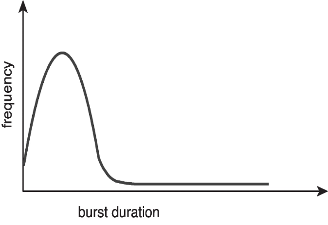
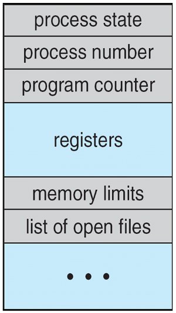
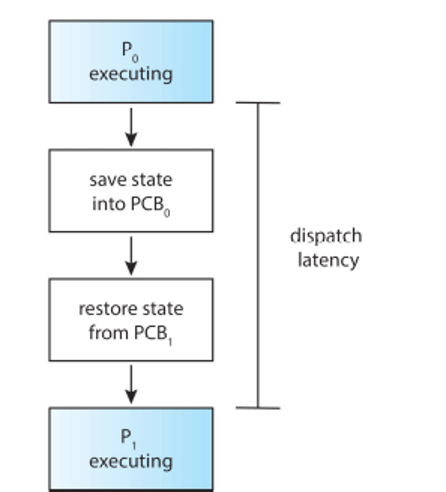

## Chapter 5

### Maximize CPU Usage (5.1)

#### Goal
Maximize CPU usage.

#### Process vs. Thread
- Kernel threads are what is actually scheduled.
- "Process scheduling" and "thread scheduling" are often used interchangeably.
- For general discussions, we will refer to process scheduling; for thread-specific issues, we will use thread scheduling, as per the book convention.

#### CPU vs. Core
- Running a process on a CPU means running it on a core.
- For the sake of clarity, we will use "CPU" and "core" interchangeably.

#### Burst
- **Definition**: A burst refers to a group of continuous actions.
    - **CPU Burst**: Continuous CPU actions.
    - **I/O Burst**: Continuous I/O actions.
- **Example**:
    - A sequence of CPU needs followed by I/O needs can be described as having 2 CPU bursts and 1 I/O burst.

#### Process Lifecycle
- The typical lifecycle consists of a CPU burst followed by an I/O burst, repeating in cycles.

#### Distribution of CPU Burst Sizes
- Burst sizes can vary significantly between programs.
- Generally, the distribution shows a higher frequency of short CPU bursts compared to long ones.

#### CPU Scheduler
- Responsible for selecting a process in the ready state and allocating it to the CPU.
- Various methods exist for determining which process to schedule next, which will be discussed in this chapter.

#### Preemptive vs. Non-preemptive Scheduling
- **Non-preemptive (Cooperative)**:
    - The process voluntarily releases the CPU.
    - Occurs during:
        - Transition from running to waiting state (waiting for an event).
        - Termination of the process.

- **Preemptive**:
    - The process is forcibly removed from the CPU.
    - Occurs during:
        - Transition from running to ready state (typically after a timer interrupt).
        - Transition from waiting to ready state (I/O completion).
    - All modern operating systems (OSs) utilize this method, enabling multiprogramming.
    - **Considerations**:
        - Shared data may become unsynchronized if a producer process is preempted before completion.
        - Kernel processes may be preempted in an inconsistent state, posing risks to user processes.
        - Although a non-preemptive kernel is possible, most modern OSs favor kernel preemption for better protection mechanisms (covered in the next chapter).

#### Dispatcher
- Transfers control of the CPU to a selected process from the ready queue.
- **Functions**:
    - Context switching between processes.
    - Switching to user mode.
    - Jumping to the correct location in the user program.
- Utilizes information in the Process Control Block (PCB).

##### PCB Reminder

- **Contents of PCB**:
    - Process state
    - Process number
    - Program counter
    - Registers
    - Memory limits
    - List of open files

- **Dispatch Latency**:
    - The time taken between one process finishing and another starting.

- Minimizing dispatch latency is crucial for overall system efficiency.

### Scheduling Criteria (5.2)

#### Overview
Metrics are used to assess the performance of scheduling activities. The importance of each metric depends on the goals of the system.

#### Key Criteria

- **CPU Utilization**:
    - Keep the CPU as busy as possible.
    - *Consideration*: In some environments, like mobile devices, this may not be a top priority due to battery life concerns.

- **Throughput**:
    - The number of processes that complete execution (burst) per time unit.

- **Turnaround Time**:
    - The total time required to execute a particular process, from submission to completion.
    - Includes time spent in all states (waiting, running, etc.).

- **Waiting Time**:
    - The amount of time a process spends in the ready queue.

- **Response Time**:
    - The time taken from when a request is submitted until the first response or result is produced.

#### Goals
Maximize all criteria; however, the importance of each varies depending on the operating environment.
