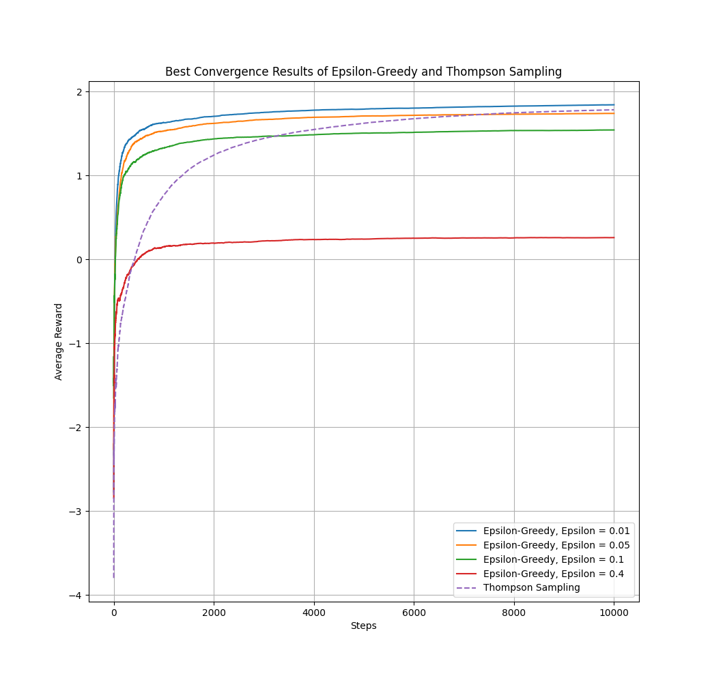
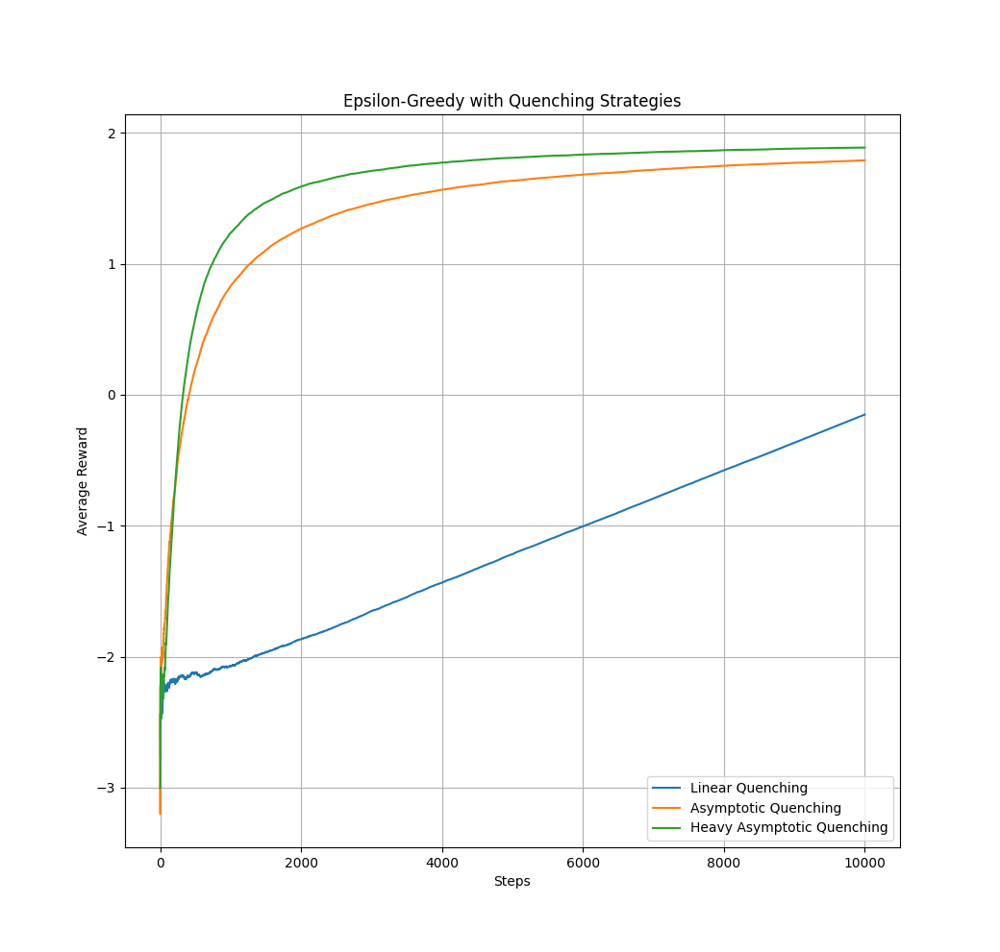
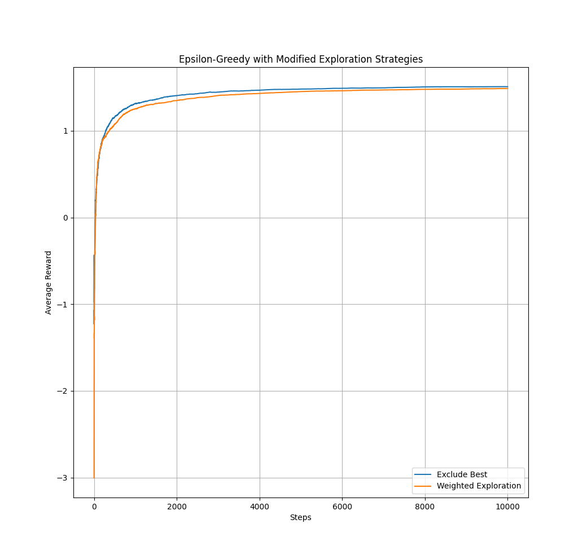
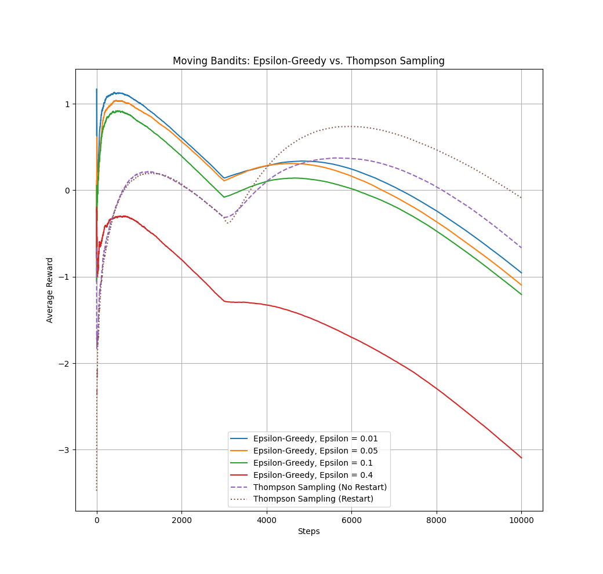

# Multi Armed Bandits Algorithm

## Team Members:
- Chandler Justice
- Kaiden McMillen
- Nate Stott

## Running the Simulation:
To run all simulations sequentially, run the `main.py` file:
```
$ python3 src/main.py
```

Each part also includes a main block which can be run by running the `part[n].py` file. For example, to only see results for part two:

```
$ python3 src/part2.py
```
## Reflection:
### Part 1


#### Compare the convergence rates for each quenching strategy.
After running the simulation with the advised epsilon values, we found that smaller values of epsilon produced a faster convergence, and also a higher value of convergence. What this tells us is that time is better spent exploiting than exploring, and a small amount of exploration is needed to produce high quality results. This makes sense as spending too much time exploring does not leave enough time to optimally exploit the space.

Comparing the Thompson Sampling vs Epsilon-greedy approaches, we can see that while it does eventually produce very good results, its rate of convergence is a lot slower. The value the Thompson Sampling method approaches is also lower than the best results obtained the Epsilon-Greedy approach. It is also worth noting that given more time, the Thompson algorithm may have continued increasing its reward as it does not appear to have converged in the plot above. Additionally, the Thompson approach is much more computationally expensive. Overall, it appears for this space the Epsilon-greedy approach with a small epsilon is the superior strategy in this space.


### Part 2

We can see that changing epsilon as the simulation progresses changes the shape of the plot and behavior of the algorithm. On linear quenching, we see very poor results. This is likely because the value of epsilon starts at one, and does not reach values closer to the found optimal of `0.01` until the end of the simulation. This is to say the algorithm is spending an excessive amount of time searching, resulting in poor results when exploiting. 

Using asymptotic quenching, we find results that contradict the results of part 1 in that much more time spent searching results in a better reward by the end of the simulation. We can see that Asymptotic Quenching performs slightly worse than Heavy Asymptotic Quenching. This suggests that agents should either choose to primarily explore or exploit, as trying to do a more even mix of both will result in the agent having a sub-optimal view of the space they are trying to exploit. In the Heavy Asymptotic Quenching approach, the agent would have a very good understanding of the space resulting in higher rewards, while in the linear and Asymptotic cases the agent may have a false perception of the space.

These approaches introduce some more dynamic behavior, wherein what is known and not known determines the search/exploit strategy. We can see overall these resulted in a lower reward than the previously analyzed approaches, but the reward curves follow a similar shape to those obtained in the previous parts. Regardless of choosing to exclude the best or focus on the unexplored, the results were about equal. This suggests these approaches are suboptimal as they do not allow for the optimal balance of exploring and exploiting.


### Part 3


We can see that when the subject of analysis changes throughout the analysis that it is at significant detriment to the performance of these algorithms. The trend of lower epsilon values being better continues from part 1, suggesting that having less information about the space and instead choosing to exploit will produce optimal results. This makes sense in this scenario as the information an agent has will become out of date as the dataset continues to change. 

Where this scenario diverges from part 1 is in both how the reward changes over time, and that the Thompson algorithm begins to show its benefits over the Epsilon-Greedy approach. We can see that the best reward was obtained from the Thompson algorithm when resetting at 3000 steps. This makes sense as after 3000 steps the space itself has undergone significant change, meaning that what optimizes the reward has also changed. 

The shape of these reward curves is also dramatically different from previous parts, we can see when the bandits suddenly shift at 3000 steps, the algorithms lose sight of what creates an optimal reward, causing worse performance across the board, especially for agents with a high epsilon. 

